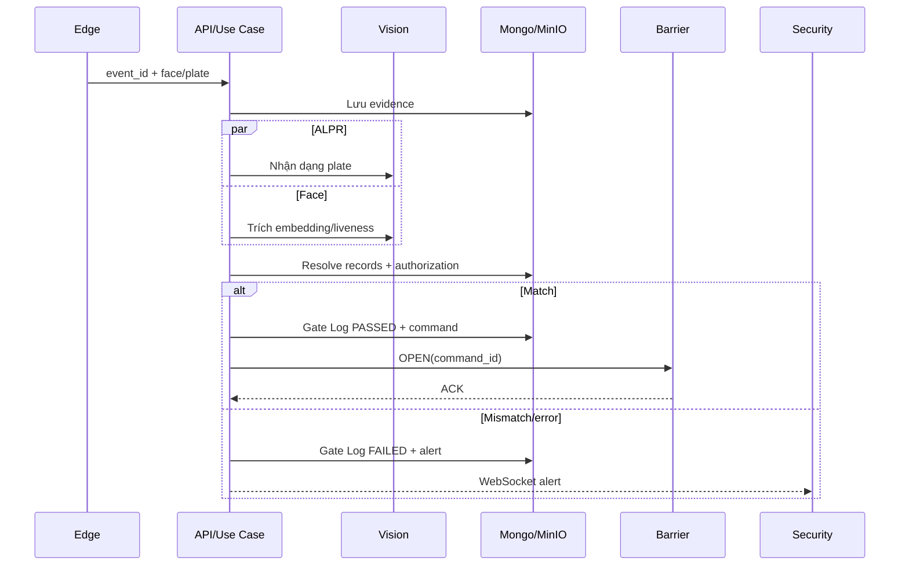
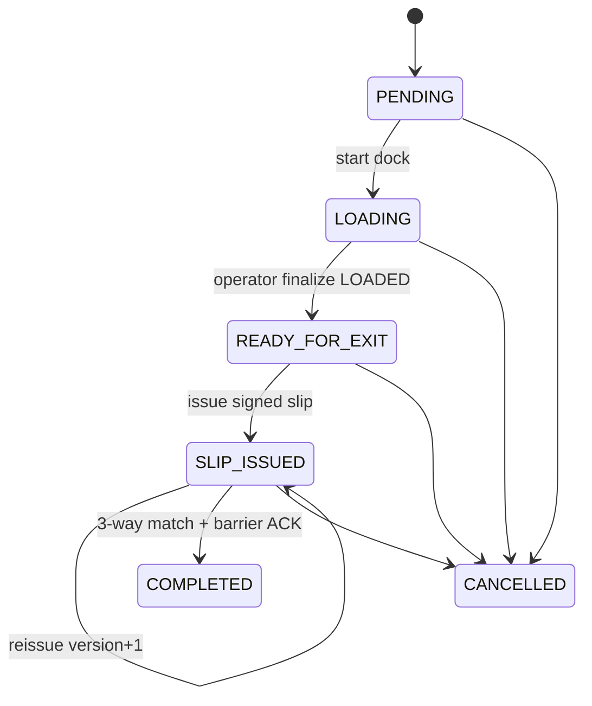
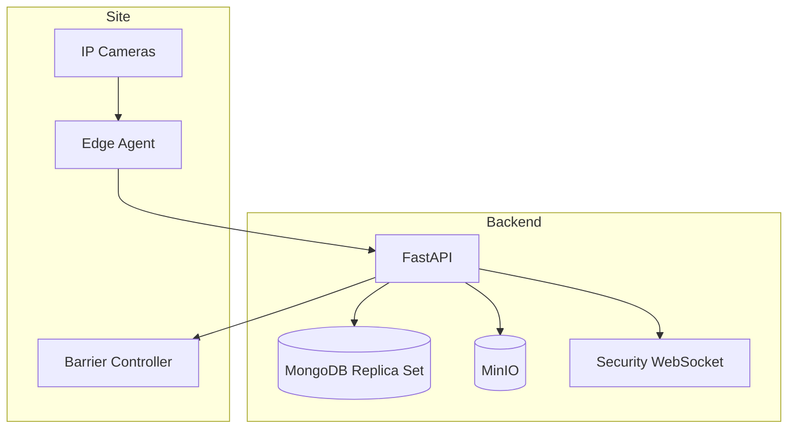

# Sơ đồ Mermaid

## Trình tự Gate In

```mermaid
sequenceDiagram
    participant E as Edge
    participant A as API/Use Case
    participant V as Vision
    participant M as Mongo/MinIO
    participant B as Barrier
    participant S as Security
    E->>A: event_id + face/plate
    A->>M: Lưu evidence
    par ALPR
        A->>V: Nhận dạng plate
    and Face
        A->>V: Trích embedding/liveness
    end
    A->>M: Resolve records + authorization
    alt Match
        A->>M: Gate Log PASSED + command
        A->>B: OPEN(command_id)
        B-->>A: ACK
    else Mismatch/error
        A->>M: Gate Log FAILED + alert
        A-->>S: WebSocket alert
    end
```

## Máy trạng thái lệnh xuất kho

```mermaid
stateDiagram-v2
    [*] --> PENDING
    PENDING --> LOADING: start dock
    LOADING --> READY_FOR_EXIT: operator finalize LOADED
    READY_FOR_EXIT --> SLIP_ISSUED: issue signed slip
    SLIP_ISSUED --> SLIP_ISSUED: reissue version+1
    SLIP_ISSUED --> COMPLETED: 3-way match + barrier ACK
    PENDING --> CANCELLED
    LOADING --> CANCELLED
    READY_FOR_EXIT --> CANCELLED
    SLIP_ISSUED --> CANCELLED
```

## Sơ đồ triển khai

```mermaid
flowchart TB
    subgraph Site
        C[IP Cameras]
        E[Edge Agent]
        G[Barrier Controller]
    end
    subgraph Backend
        A[FastAPI]
        D[(MongoDB Replica Set)]
        O[(MinIO)]
        W[Security WebSocket]
    end
    C --> E --> A
    A --> D
    A --> O
    A --> G
    A --> W
```
